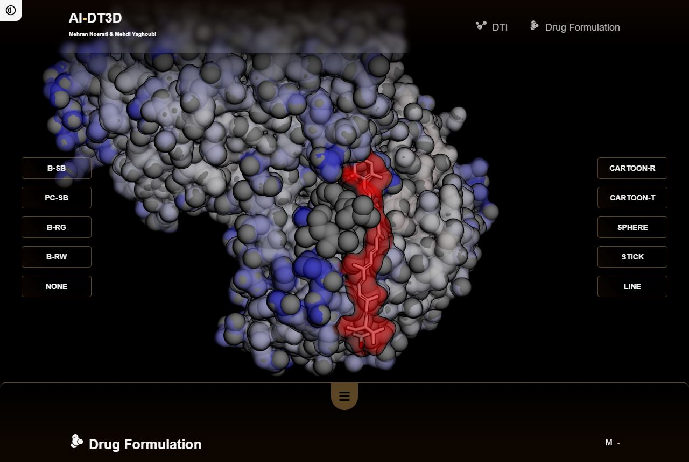

# DTI

**
Drug–target interaction prediction
**

 

Identifying the interactions between drugs and target proteins is a key step in drug discovery. This not only aids to understand the disease mechanism, but also helps to identify unexpected therapeutic activity or adverse side effects of drugs. Hence, drug-target interaction prediction becomes an essential tool in the field of drug repurposing.

 

 

 

 
